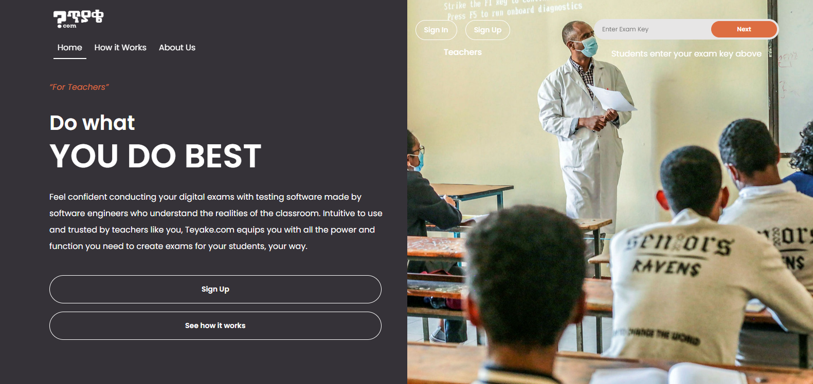
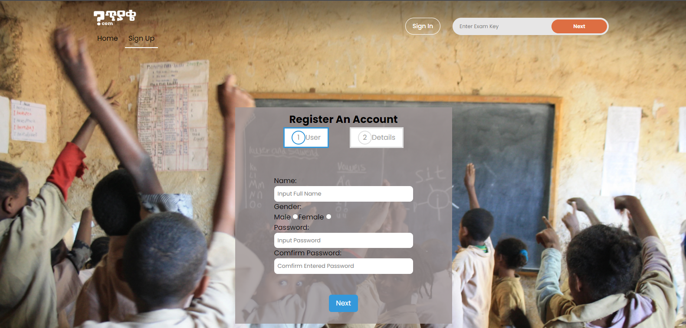
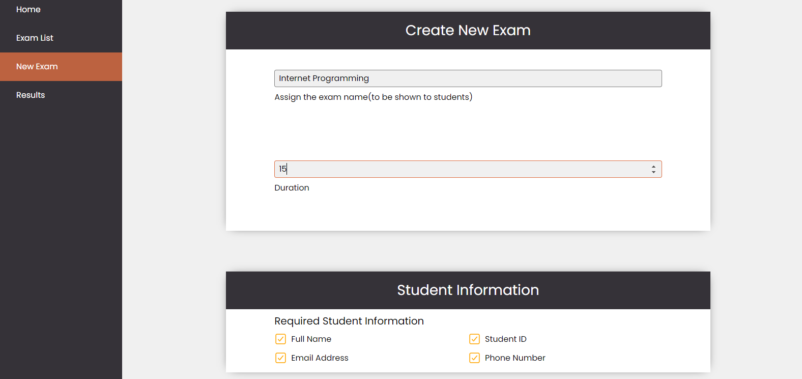
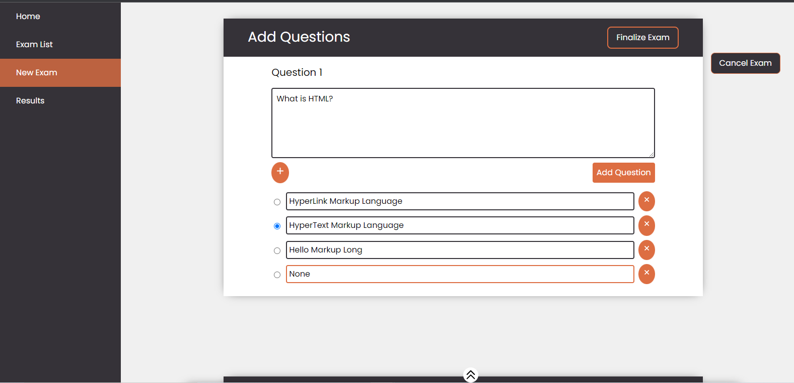
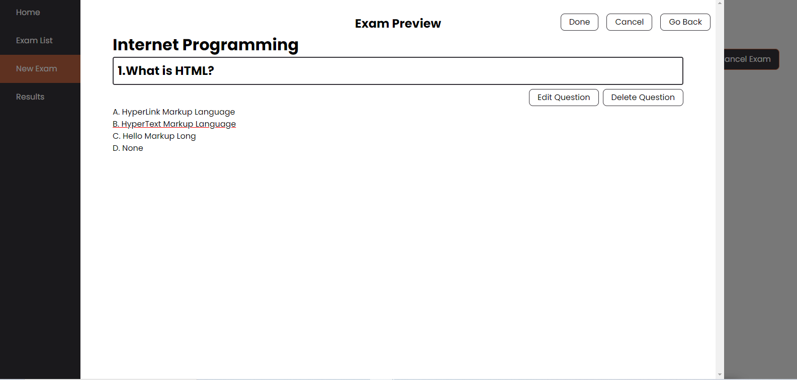
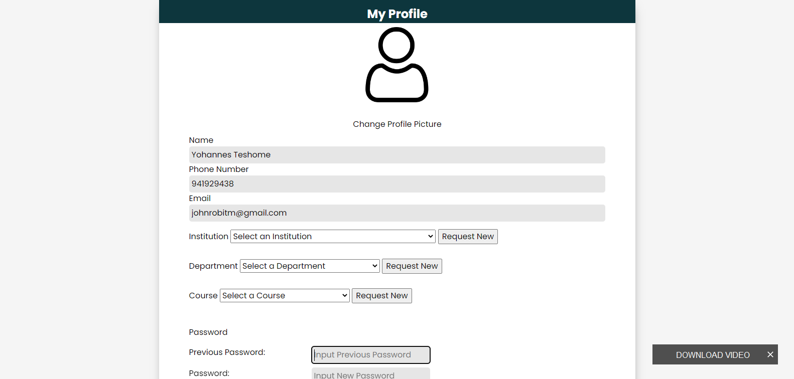
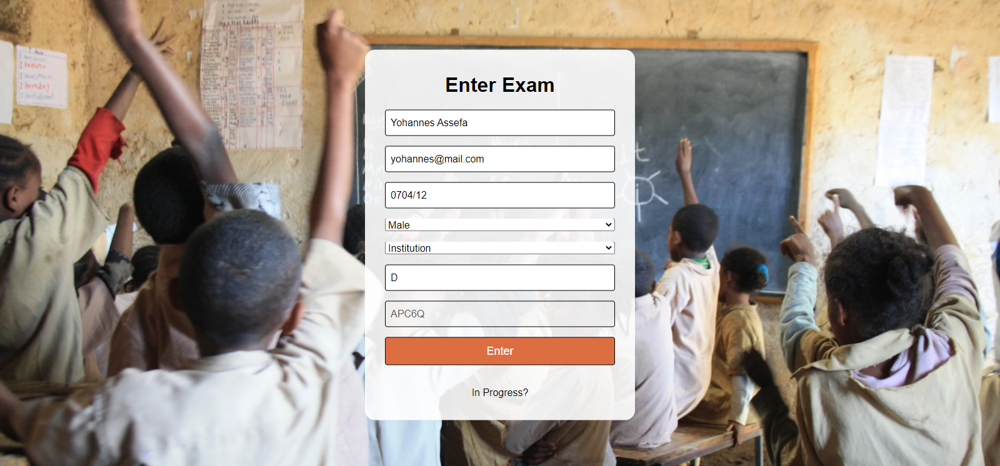

# Teyake.com

# Project Description
## What our Project does,
Our project teyake.com is built by visionary team who wanted to change the problems that arise around exam giving techniques. As we know, the current education system is challenged with several issues like inadequate platforms that fulfills the needs of teachers and students. The team behind Teyake.com seek to solve this problem by providing a secure and trusted platform for teachers that allows them to create exams which they can easily manage easily and track records and scores of their students without further ado.

# How to Use

* teyake.com Home Page *

Teyake.com allows teachers of any educational institution to create and manage exams. From the home page above as you can see an examiner can log in to the system using its eamil. While examinees use an exam key to take exams with out the need to register.

## Examiner Registration

* teyake.com Registration Page *

Examiner can register using his/her email and picks his/her institution. In order to be successfully registered our system sends a confirmation code to the requested email. After filling in the confirmation code the examiner is successfully logged in.

## Creating Exam

* Creating Exam *

Examiner can create exam from the dashboard page by inserting necessary information about the exam including exam name and what information to take from the students.

* Writing Question to the Exam *

## Previewing Exam

* Preview Exam *

After Creating the exam the examiner can preview what the exam looks like in the examinees point of view by previewing the exam.

##Profile

* Preview Exam *

The examiner can edit his/her information including uploading profile picture.

## Examinee Taking Exams

An examinee can take exam by providing the exam key of the exam.

## Exam Inputs

The examinee inputs the information required in order to take the exam. After completing this information the examinee will automatically take the exam

# Credits
The team consists of six members from Addis Ababa Science and Technology University. The team believed that digital exams offered advantages such as auto-marking and integrated tools and could eliminate problems like illegible handwriting and excessive paper waste. At the time, few digital exam platforms existed, and the ones that did felt over-complicated and out of touch with a teacher’s real needs in the classroom. Determined to find a solution that worked in the real world for teachers, our  team decided to build this website.

Our team consists of
1. Yohannes Assefa
2. Yohannes Teshome  
3. Yohannes Mesganaw   
4. Tsion Moges 
5. Yohannes Fantahun 
6. Yohannes Abebe.
# Technologies Used
We used different technologies to develope our project. 
- Telegram: we used this social media platform as a collaboration tool. This made it feasible for team members who may not be working in the same space to keep updated             in real time.
- Database: MySQL
- Programming language: html, CSS, javascript, php.
- IDE: MS Visual Studio Code
- Web server: Apache
- UI and graphic tools: Adobe illustrator

**Database Info**
The database information is included in the [Database folder](https://github.com/John-droid-dotcom/teyake/tree/main/database).
